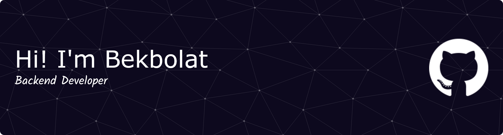

<h1 align="center">Hi there👋</h1>

<h3 align="left">About me:</h3>

- ⚡ Backend Developer | Go enthusiast  
- 🌱 I’m constantly leveling up: architecture, algorithms, databases, distributed systems  
- 💬 Ask me about backend development, Go, databases, and microservices  
- 🎸 Fun fact: I shred strings as well as I write code!  ;)

### 🛠 Tech Stack

                               

---

### 📫 Connect with me:
   

